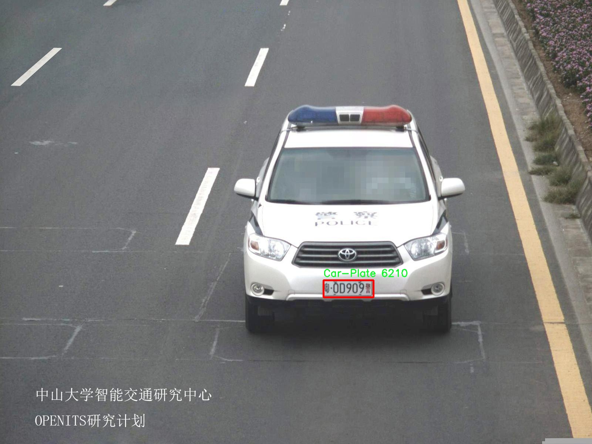

# 车牌检测系统源码分享
 # [一条龙教学YOLOV8标注好的数据集一键训练_70+全套改进创新点发刊_Web前端展示]

### 1.研究背景与意义

项目参考[AAAI Association for the Advancement of Artificial Intelligence](https://gitee.com/qunmasj/projects)

项目来源[AACV Association for the Advancement of Computer Vision](https://kdocs.cn/l/cszuIiCKVNis)

研究背景与意义

随着智能交通系统的快速发展，车牌检测技术在交通管理、智能监控、停车场管理等领域中扮演着越来越重要的角色。车牌作为车辆身份的唯一标识，其准确识别不仅能够提高交通管理的效率，还能为犯罪侦查、违章查处等提供有力支持。近年来，深度学习技术的飞速进步为车牌检测提供了新的解决方案，尤其是YOLO（You Only Look Once）系列模型因其高效性和实时性，成为车牌检测领域的热门选择。YOLOv8作为该系列的最新版本，进一步提升了检测精度和速度，适用于各种复杂的场景。

然而，尽管YOLOv8在许多应用中表现出色，但在特定场景下，尤其是车牌检测任务中，仍然存在一些挑战。例如，车牌的多样性、光照变化、遮挡、角度变化等因素都会影响检测的准确性。因此，针对车牌检测任务对YOLOv8进行改进，旨在提升其在复杂环境下的鲁棒性和准确性，具有重要的理论与实践意义。

本研究基于6800张车牌图像构建的数据集，涵盖了多种车牌样式和拍摄条件，确保了数据的多样性和代表性。该数据集的单一类别设置（车牌）使得模型在训练过程中能够集中学习车牌的特征，减少了背景干扰，从而提高了检测的精度。通过对YOLOv8模型的改进，结合数据集的特性，我们将探索如何优化模型的网络结构、损失函数以及数据增强策略，以实现更高效的车牌检测。

此外，车牌检测系统的改进不仅限于提高检测精度和速度，还应考虑其在实际应用中的可行性和适应性。通过对改进后的YOLOv8模型进行系统评估，我们将分析其在不同环境下的表现，包括城市道路、高速公路、夜间及恶劣天气等场景。这将为未来的智能交通系统提供重要的技术支持和理论依据。

总之，基于改进YOLOv8的车牌检测系统的研究，不仅能够推动车牌检测技术的发展，还将为智能交通管理提供更为高效的解决方案。随着城市化进程的加快和车辆数量的激增，车牌检测技术的需求将持续增长。因此，本研究具有重要的现实意义和广阔的应用前景，期待能够为相关领域的研究者和实践者提供有价值的参考和借鉴。

### 2.图片演示


##### 注意：由于此博客编辑较早，上面“2.图片演示”和“3.视频演示”展示的系统图片或者视频可能为老版本，新版本在老版本的基础上升级如下：（实际效果以升级的新版本为准）

  （1）适配了YOLOV8的“目标检测”模型和“实例分割”模型，通过加载相应的权重（.pt）文件即可自适应加载模型。

  （2）支持“图片识别”、“视频识别”、“摄像头实时识别”三种识别模式。

  （3）支持“图片识别”、“视频识别”、“摄像头实时识别”三种识别结果保存导出，解决手动导出（容易卡顿出现爆内存）存在的问题，识别完自动保存结果并导出到tempDir中。

  （4）支持Web前端系统中的标题、背景图等自定义修改，后面提供修改教程。

  另外本项目提供训练的数据集和训练教程,暂不提供权重文件（best.pt）,需要您按照教程进行训练后实现图片演示和Web前端界面演示的效果。

### 3.视频演示

[3.1 视频演示](https://www.bilibili.com/video/BV1cA2tYBECk/)

### 4.数据集信息展示

##### 4.1 本项目数据集详细数据（类别数＆类别名）

nc: 1
names: ['Car-Plate']


##### 4.2 本项目数据集信息介绍

数据集信息展示

在现代智能交通系统中，车牌检测技术扮演着至关重要的角色，广泛应用于车辆识别、交通监控、停车管理等多个领域。为此，构建一个高效且准确的车牌检测模型显得尤为重要。本研究采用的数据集名为“Car-plate detection”，专门用于训练和改进YOLOv8的车牌检测系统。该数据集的设计旨在为模型提供丰富的训练样本，以提升其在实际应用中的性能。

“Car-plate detection”数据集包含了多样化的车牌图像，涵盖了不同品牌、颜色、形状和背景的车辆。这些图像不仅反映了不同国家和地区的车牌样式，还考虑了各种光照条件和拍摄角度，确保模型在多变的环境中依然能够保持高效的识别能力。数据集中仅包含一个类别，即“Car-Plate”，这意味着所有的标注都专注于车牌的检测和识别，简化了模型的训练过程，使其能够更专注于车牌特征的学习。

在数据集的构建过程中，图像的采集和标注遵循了严格的标准。每一张图像都经过精心挑选，确保其清晰度和可辨识性，以便为YOLOv8模型提供高质量的训练数据。此外，标注过程采用了专业的标注工具，确保车牌区域的边界框准确无误。这种高质量的标注不仅有助于提高模型的训练效率，也能显著提升最终检测结果的准确性。

数据集的规模也是影响模型性能的重要因素之一。“Car-plate detection”数据集经过精心设计，包含了数千张图像，确保了模型在训练过程中能够接触到足够多的样本。这种丰富的样本量使得模型能够更好地学习到车牌的多样性特征，从而在实际应用中实现更高的识别率和更低的误检率。

为了进一步提升模型的泛化能力，数据集还采用了数据增强技术。这些技术包括随机裁剪、旋转、亮度调整等，旨在模拟不同的拍摄条件和环境变化。通过这些增强，模型能够在训练过程中学习到更为广泛的特征，从而在面对未见过的车牌样式时，依然能够保持较高的检测性能。

总之，“Car-plate detection”数据集为改进YOLOv8的车牌检测系统提供了坚实的基础。通过高质量的图像、精确的标注和丰富的样本量，该数据集不仅为模型的训练提供了必要的支持，也为后续的研究和应用奠定了良好的基础。随着技术的不断进步，车牌检测系统将在智能交通领域发挥越来越重要的作用，而“Car-plate detection”数据集的价值也将随着这些应用的推广而不断提升。




### 5.全套项目环境部署视频教程（零基础手把手教学）

[5.1 环境部署教程链接（零基础手把手教学）](https://www.ixigua.com/7404473917358506534?logTag=c807d0cbc21c0ef59de5)


[5.2 安装Python虚拟环境创建和依赖库安装视频教程链接（零基础手把手教学）](https://www.ixigua.com/7404474678003106304?logTag=1f1041108cd1f708b01a)

### 6.手把手YOLOV8训练视频教程（零基础小白有手就能学会）

[6.1 手把手YOLOV8训练视频教程（零基础小白有手就能学会）](https://www.ixigua.com/7404477157818401292?logTag=d31a2dfd1983c9668658)


按照上面的训练视频教程链接加载项目提供的数据集，运行train.py即可开始训练



     Epoch   gpu_mem       box       obj       cls    labels  img_size
     1/200     20.8G   0.01576   0.01955  0.007536        22      1280: 100%|██████████| 849/849 [14:42<00:00,  1.04s/it]
               Class     Images     Labels          P          R     mAP@.5 mAP@.5:.95: 100%|██████████| 213/213 [01:14<00:00,  2.87it/s]
                 all       3395      17314      0.994      0.957      0.0957      0.0843

     Epoch   gpu_mem       box       obj       cls    labels  img_size
     2/200     20.8G   0.01578   0.01923  0.007006        22      1280: 100%|██████████| 849/849 [14:44<00:00,  1.04s/it]
               Class     Images     Labels          P          R     mAP@.5 mAP@.5:.95: 100%|██████████| 213/213 [01:12<00:00,  2.95it/s]
                 all       3395      17314      0.996      0.956      0.0957      0.0845

     Epoch   gpu_mem       box       obj       cls    labels  img_size
     3/200     20.8G   0.01561    0.0191  0.006895        27      1280: 100%|██████████| 849/849 [10:56<00:00,  1.29it/s]
               Class     Images     Labels          P          R     mAP@.5 mAP@.5:.95: 100%|███████   | 187/213 [00:52<00:00,  4.04it/s]
                 all       3395      17314      0.996      0.957      0.0957      0.0845


### 7.70+种全套YOLOV8创新点代码加载调参视频教程（一键加载写好的改进模型的配置文件）

[7.1 70+种全套YOLOV8创新点代码加载调参视频教程（一键加载写好的改进模型的配置文件）](https://www.ixigua.com/7404478314661806627?logTag=29066f8288e3f4eea3a4)

### 8.70+种全套YOLOV8创新点原理讲解（非科班也可以轻松写刊发刊，V10版本正在科研待更新）

#### 由于篇幅限制，每个创新点的具体原理讲解就不一一展开，具体见下列网址中的创新点对应子项目的技术原理博客网址【Blog】：


[8.1 70+种全套YOLOV8创新点原理讲解链接](https://gitee.com/qunmasj/good)

#### 部分改进原理讲解(完整的改进原理见上图和技术博客链接)【如果此小节的图加载失败可以通过CSDN或者Github搜索该博客的标题访问原始博客，原始博客图片显示正常】

### YOLOv8简介
#### Backbone
Darknet-53
53指的是“52层卷积”+output layer。

借鉴了其他算法的这些设计思想

借鉴了VGG的思想，使用了较多的3×3卷积，在每一次池化操作后，将通道数翻倍；

借鉴了network in network的思想，使用全局平均池化（global average pooling）做预测，并把1×1的卷积核置于3×3的卷积核之间，用来压缩特征；（我没找到这一步体现在哪里）


使用了批归一化层稳定模型训练，加速收敛，并且起到正则化作用。

    以上三点为Darknet19借鉴其他模型的点。Darknet53当然是在继承了Darknet19的这些优点的基础上再新增了下面这些优点的。因此列在了这里

借鉴了ResNet的思想，在网络中大量使用了残差连接，因此网络结构可以设计的很深，并且缓解了训练中梯度消失的问题，使得模型更容易收敛。

使用步长为2的卷积层代替池化层实现降采样。（这一点在经典的Darknet-53上是很明显的，output的长和宽从256降到128，再降低到64，一路降低到8，应该是通过步长为2的卷积层实现的；在YOLOv8的卷积层中也有体现，比如图中我标出的这些位置）

#### 特征融合

模型架构图如下

  Darknet-53的特点可以这样概括：（Conv卷积模块+Residual Block残差块）串行叠加4次

  Conv卷积层+Residual Block残差网络就被称为一个stage


上面红色指出的那个，原始的Darknet-53里面有一层 卷积，在YOLOv8里面，把一层卷积移除了

为什么移除呢？

        原始Darknet-53模型中间加的这个卷积层做了什么？滤波器（卷积核）的个数从 上一个卷积层的512个，先增加到1024个卷积核，然后下一层卷积的卷积核的个数又降低到512个

        移除掉这一层以后，少了1024个卷积核，就可以少做1024次卷积运算，同时也少了1024个3×3的卷积核的参数，也就是少了9×1024个参数需要拟合。这样可以大大减少了模型的参数，（相当于做了轻量化吧）

        移除掉这个卷积层，可能是因为作者发现移除掉这个卷积层以后，模型的score有所提升，所以才移除掉的。为什么移除掉以后，分数有所提高呢？可能是因为多了这些参数就容易，参数过多导致模型在训练集删过拟合，但是在测试集上表现很差，最终模型的分数比较低。你移除掉这个卷积层以后，参数减少了，过拟合现象不那么严重了，泛化能力增强了。当然这个是，拿着你做实验的结论，反过来再找补，再去强行解释这种现象的合理性。


通过MMdetection官方绘制册这个图我们可以看到，进来的这张图片经过一个“Feature Pyramid Network(简称FPN)”，然后最后的P3、P4、P5传递给下一层的Neck和Head去做识别任务。 PAN（Path Aggregation Network）


“FPN是自顶向下，将高层的强语义特征传递下来。PAN就是在FPN的后面添加一个自底向上的金字塔，对FPN补充，将低层的强定位特征传递上去，

FPN是自顶（小尺寸，卷积次数多得到的结果，语义信息丰富）向下（大尺寸，卷积次数少得到的结果），将高层的强语义特征传递下来，对整个金字塔进行增强，不过只增强了语义信息，对定位信息没有传递。PAN就是针对这一点，在FPN的后面添加一个自底（卷积次数少，大尺寸）向上（卷积次数多，小尺寸，语义信息丰富）的金字塔，对FPN补充，将低层的强定位特征传递上去，又被称之为“双塔战术”。

FPN层自顶向下传达强语义特征，而特征金字塔则自底向上传达强定位特征，两两联手，从不同的主干层对不同的检测层进行参数聚合,这样的操作确实很皮。
#### 自底向上增强


而 PAN（Path Aggregation Network）是对 FPN 的一种改进，它的设计理念是在 FPN 后面添加一个自底向上的金字塔。PAN 引入了路径聚合的方式，通过将浅层特征图（低分辨率但语义信息较弱）和深层特征图（高分辨率但语义信息丰富）进行聚合，并沿着特定的路径传递特征信息，将低层的强定位特征传递上去。这样的操作能够进一步增强多尺度特征的表达能力，使得 PAN 在目标检测任务中表现更加优秀。


### Gold-YOLO简介
YOLO系列模型面世至今已有8年，由于其优异的性能，已成为目标检测领域的标杆。在系列模型经过十多个不同版本的改进发展逐渐稳定完善的今天，研究人员更多关注于单个计算模块内结构的精细调整，或是head部分和训练方法上的改进。但这并不意味着现有模式已是最优解。

当前YOLO系列模型通常采用类FPN方法进行信息融合，而这一结构在融合跨层信息时存在信息损失的问题。针对这一问题，我们提出了全新的信息聚集-分发（Gather-and-Distribute Mechanism）GD机制，通过在全局视野上对不同层级的特征进行统一的聚集融合并分发注入到不同层级中，构建更加充分高效的信息交互融合机制，并基于GD机制构建了Gold-YOLO。在COCO数据集中，我们的Gold-YOLO超越了现有的YOLO系列，实现了精度-速度曲线上的SOTA。


精度和速度曲线（TensorRT7）


精度和速度曲线（TensorRT8）
传统YOLO的问题
在检测模型中，通常先经过backbone提取得到一系列不同层级的特征，FPN利用了backbone的这一特点，构建了相应的融合结构：不层级的特征包含着不同大小物体的位置信息，虽然这些特征包含的信息不同，但这些特征在相互融合后能够互相弥补彼此缺失的信息，增强每一层级信息的丰富程度，提升网络性能。

原始的FPN结构由于其层层递进的信息融合模式，使得相邻层的信息能够充分融合，但也导致了跨层信息融合存在问题：当跨层的信息进行交互融合时，由于没有直连的交互通路，只能依靠中间层充当“中介”进行融合，导致了一定的信息损失。之前的许多工作中都关注到了这一问题，而解决方案通常是通过添加shortcut增加更多的路径，以增强信息流动。

然而传统的FPN结构即便改进后，由于网络中路径过多，且交互方式不直接，基于FPN思想的信息融合结构仍然存在跨层信息交互困难和信息损失的问题。

#### Gold-YOLO：全新的信息融合交互机制


#### Gold-YOLO架构
参考该博客提出的一种全新的信息交互融合机制：信息聚集-分发机制(Gather-and-Distribute Mechanism)。该机制通过在全局上融合不同层次的特征得到全局信息，并将全局信息注入到不同层级的特征中，实现了高效的信息交互和融合。在不显著增加延迟的情况下GD机制显著增强了Neck部分的信息融合能力，提高了模型对不同大小物体的检测能力。

GD机制通过三个模块实现：信息对齐模块(FAM)、信息融合模块(IFM)和信息注入模块(Inject)。

信息对齐模块负责收集并对齐不同层级不同大小的特征

信息融合模块通过使用卷积或Transformer算子对对齐后的的特征进行融合，得到全局信息

信息注入模块将全局信息注入到不同层级中

在Gold-YOLO中，针对模型需要检测不同大小的物体的需要，并权衡精度和速度，我们构建了两个GD分支对信息进行融合：低层级信息聚集-分发分支(Low-GD)和高层级信息聚集-分发分支(High-GD)，分别基于卷积和transformer提取和融合特征信息。

此外,为了促进局部信息的流动，我们借鉴现有工作，构建了一个轻量级的邻接层融合模块，该模块在局部尺度上结合了邻近层的特征，进一步提升了模型性能。我们还引入并验证了预训练方法对YOLO模型的有效性，通过在ImageNet 1K上使用MAE方法对主干进行预训练，显著提高了模型的收敛速度和精度。


### 9.系统功能展示（检测对象为举例，实际内容以本项目数据集为准）

图9.1.系统支持检测结果表格显示

  图9.2.系统支持置信度和IOU阈值手动调节

  图9.3.系统支持自定义加载权重文件best.pt(需要你通过步骤5中训练获得)

  图9.4.系统支持摄像头实时识别

  图9.5.系统支持图片识别

  图9.6.系统支持视频识别

  图9.7.系统支持识别结果文件自动保存

  图9.8.系统支持Excel导出检测结果数据


### 10.原始YOLOV8算法原理

原始YOLOv8算法原理

YOLO（You Only Look Once）系列算法自其诞生以来，便以其高效的目标检测能力而受到广泛关注。随着技术的不断进步，YOLO系列也经历了多次迭代，最终发展到YOLOv8版本。YOLOv8在保持高检测速度的同时，进一步提升了检测精度，成为了当前目标检测领域的一个重要里程碑。其核心结构由输入模块、Backbone骨干网络、Neck特征融合网络和Head检测模块四个部分组成，各个模块之间相辅相成，共同推动了YOLOv8的卓越性能。

在YOLOv8的输入模块中，首先对输入图像进行预处理，以适应后续的特征提取过程。该模块不仅负责调整图像的比例，还实现了Mosaic增强和瞄点计算等功能。这些预处理步骤为后续的特征提取奠定了基础，使得模型能够在不同场景下更好地适应和识别目标。

YOLOv8的Backbone部分采用了CSPDarknet（Cross Stage Partial Darknet）结构，作为特征提取的核心。与前代模型YOLOv5相比，YOLOv8引入了C2f模块来替代C3模块。C2f模块通过将输入特征图分为两个分支，并在每个分支上进行卷积操作，能够有效地增强特征图的维度。这种设计不仅保留了轻量级特性，还通过更多的残差连接，提升了梯度流动的信息，从而提高了特征提取的效率。此外，YOLOv8还引入了快速空间金字塔池化（SPPF）模块，进一步增强了对不同尺度特征的提取能力。SPPF通过使用不同内核尺寸的池化操作，能够有效地合并特征图，减少模型的参数量和计算量，同时提升特征提取的效率。

在特征融合阶段，YOLOv8的Neck模块采用了双塔结构，将特征金字塔网络（FPN）与路径聚合网络（PAN）相结合。这种结构的设计旨在促进语义特征与定位特征之间的转移，增强网络的特征融合能力，从而获取更丰富的特征信息。这一阶段的改进使得YOLOv8在处理不同尺度目标时，表现出更强的适应性和准确性。

最后，YOLOv8的Head模块负责将提取到的特征图转换为最终的检测结果。该模块采用了解耦合头结构，将分类和回归任务分开处理。这种设计不仅加速了模型的收敛速度，还提升了检测的准确性。此外，YOLOv8还采用了无锚框（Anchor-Free）检测方式，直接预测目标的中心点和宽高比例，进一步减少了Anchor框的数量，提高了检测速度和准确度。

在训练过程中，YOLOv8采用了一系列先进的数据增强技术和损失计算方法，以进一步提升模型的性能。例如，在训练的最后10个epoch中，关闭了马赛克增强，并使用动态任务对齐分配策略，以优化样本的分配。此外，YOLOv8在损失计算方面也进行了创新，使用了BCELoss作为分类损失，DFLLoss与CIoULoss作为回归损失，这些策略的引入有效地提升了模型的学习能力和泛化能力。

综上所述，YOLOv8算法通过对Backbone、Neck和Head模块的精心设计与优化，实现了在目标检测领域的重大突破。其创新的C2f模块、SPPF结构以及解耦合头设计，使得YOLOv8在特征提取和目标检测的效率与准确性上都达到了新的高度。随着YOLOv8的不断发展与应用，其在实际场景中的表现也将进一步推动目标检测技术的进步，展现出更广阔的应用前景。


### 11.项目核心源码讲解（再也不用担心看不懂代码逻辑）

#### 11.1 70+种YOLOv8算法改进源码大全和调试加载训练教程（非必要）\ultralytics\models\sam\amg.py

以下是代码中最核心的部分，并附上详细的中文注释：

```python
import torch
import numpy as np
from itertools import product
import math

def is_box_near_crop_edge(boxes: torch.Tensor,
                          crop_box: List[int],
                          orig_box: List[int],
                          atol: float = 20.0) -> torch.Tensor:
    """
    判断给定的边界框是否接近裁剪边缘。

    参数：
    boxes: 需要判断的边界框，格式为 (x1, y1, x2, y2) 的张量。
    crop_box: 当前裁剪框的边界 [x0, y0, x1, y1]。
    orig_box: 原始图像的边界框 [x0, y0, x1, y1]。
    atol: 允许的绝对误差，默认为 20.0。

    返回：
    一个布尔张量，指示每个边界框是否接近裁剪边缘。
    """
    crop_box_torch = torch.as_tensor(crop_box, dtype=torch.float, device=boxes.device)
    orig_box_torch = torch.as_tensor(orig_box, dtype=torch.float, device=boxes.device)
    boxes = uncrop_boxes_xyxy(boxes, crop_box).float()  # 将边界框还原到原始坐标系
    near_crop_edge = torch.isclose(boxes, crop_box_torch[None, :], atol=atol, rtol=0)  # 判断是否接近裁剪框
    near_image_edge = torch.isclose(boxes, orig_box_torch[None, :], atol=atol, rtol=0)  # 判断是否接近原始图像边缘
    near_crop_edge = torch.logical_and(near_crop_edge, ~near_image_edge)  # 只保留接近裁剪框而不接近原始图像边缘的框
    return torch.any(near_crop_edge, dim=1)  # 返回是否有任何边界框接近裁剪边缘

def uncrop_boxes_xyxy(boxes: torch.Tensor, crop_box: List[int]) -> torch.Tensor:
    """
    将边界框还原到原始图像坐标系。

    参数：
    boxes: 要还原的边界框，格式为 (x1, y1, x2, y2) 的张量。
    crop_box: 当前裁剪框的边界 [x0, y0, x1, y1]。

    返回：
    还原后的边界框张量。
    """
    x0, y0, _, _ = crop_box
    offset = torch.tensor([[x0, y0, x0, y0]], device=boxes.device)  # 计算偏移量
    if len(boxes.shape) == 3:  # 如果 boxes 有通道维度
        offset = offset.unsqueeze(1)  # 增加维度以便广播
    return boxes + offset  # 返回还原后的边界框

def generate_crop_boxes(im_size: Tuple[int, ...], n_layers: int,
                        overlap_ratio: float) -> Tuple[List[List[int]], List[int]]:
    """
    生成不同大小的裁剪框。

    参数：
    im_size: 图像的尺寸 (高度, 宽度)。
    n_layers: 裁剪层数。
    overlap_ratio: 重叠比例。

    返回：
    裁剪框列表和对应的层索引列表。
    """
    crop_boxes, layer_idxs = [], []
    im_h, im_w = im_size
    short_side = min(im_h, im_w)

    # 添加原始图像的裁剪框
    crop_boxes.append([0, 0, im_w, im_h])
    layer_idxs.append(0)

    def crop_len(orig_len, n_crops, overlap):
        """计算裁剪框的长度。"""
        return int(math.ceil((overlap * (n_crops - 1) + orig_len) / n_crops))

    for i_layer in range(n_layers):
        n_crops_per_side = 2 ** (i_layer + 1)  # 每层的裁剪框数量
        overlap = int(overlap_ratio * short_side * (2 / n_crops_per_side))  # 计算重叠长度

        crop_w = crop_len(im_w, n_crops_per_side, overlap)  # 计算裁剪框宽度
        crop_h = crop_len(im_h, n_crops_per_side, overlap)  # 计算裁剪框高度

        crop_box_x0 = [int((crop_w - overlap) * i) for i in range(n_crops_per_side)]
        crop_box_y0 = [int((crop_h - overlap) * i) for i in range(n_crops_per_side)]

        # 生成裁剪框的坐标
        for x0, y0 in product(crop_box_x0, crop_box_y0):
            box = [x0, y0, min(x0 + crop_w, im_w), min(y0 + crop_h, im_h)]
            crop_boxes.append(box)
            layer_idxs.append(i_layer + 1)

    return crop_boxes, layer_idxs  # 返回裁剪框和层索引

def batched_mask_to_box(masks: torch.Tensor) -> torch.Tensor:
    """
    计算掩膜周围的边界框，格式为 XYXY。

    参数：
    masks: 输入掩膜，形状为 C1xC2x...xHxW。

    返回：
    对应的边界框，形状为 C1xC2x...x4。
    """
    if torch.numel(masks) == 0:  # 如果掩膜为空
        return torch.zeros(*masks.shape[:-2], 4, device=masks.device)  # 返回全零的边界框

    shape = masks.shape
    h, w = shape[-2:]  # 获取掩膜的高度和宽度
    masks = masks.flatten(0, -3) if len(shape) > 2 else masks.unsqueeze(0)  # 规范化形状为 CxHxW

    # 获取上下边缘
    in_height, _ = torch.max(masks, dim=-1)
    in_height_coords = in_height * torch.arange(h, device=in_height.device)[None, :]
    bottom_edges, _ = torch.max(in_height_coords, dim=-1)
    in_height_coords = in_height_coords + h * (~in_height)
    top_edges, _ = torch.min(in_height_coords, dim=-1)

    # 获取左右边缘
    in_width, _ = torch.max(masks, dim=-2)
    in_width_coords = in_width * torch.arange(w, device=in_width.device)[None, :]
    right_edges, _ = torch.max(in_width_coords, dim=-1)
    in_width_coords = in_width_coords + w * (~in_width)
    left_edges, _ = torch.min(in_width_coords, dim=-1)

    # 如果掩膜为空，右边缘会在左边缘左侧
    empty_filter = (right_edges < left_edges) | (bottom_edges < top_edges)
    out = torch.stack([left_edges, top_edges, right_edges, bottom_edges], dim=-1)
    out = out * (~empty_filter).unsqueeze(-1)  # 将空的边界框替换为 [0, 0, 0, 0]

    return out.reshape(*shape[:-2], 4) if len(shape) > 2 else out[0]  # 返回原始形状的边界框
```

### 主要功能说明：
1. **is_box_near_crop_edge**: 判断边界框是否接近裁剪框的边缘。
2. **uncrop_boxes_xyxy**: 将裁剪框的坐标还原到原始图像坐标系。
3. **generate_crop_boxes**: 生成不同大小的裁剪框，支持多层裁剪。
4. **batched_mask_to_box**: 从掩膜中计算出对应的边界框。 

这些函数在图像处理和目标检测中非常重要，尤其是在处理裁剪和边界框生成时。

这个文件是Ultralytics YOLO（You Only Look Once）算法的一部分，主要涉及图像处理和掩膜（mask）操作的功能。文件中包含多个函数，以下是对这些函数的逐一分析和说明。

首先，`is_box_near_crop_edge`函数用于判断给定的边界框（boxes）是否接近裁剪边缘。它接收边界框、裁剪框和原始框作为输入，并返回一个布尔张量，指示哪些边界框接近裁剪边缘。通过将边界框从裁剪坐标系转换回原始坐标系，然后与裁剪框和原始框进行比较，来判断它们的接近程度。

接下来，`batch_iterator`函数用于从输入参数中生成批次数据。它确保所有输入参数的长度相同，并根据指定的批次大小生成数据批次。

`calculate_stability_score`函数计算一组掩膜的稳定性得分。稳定性得分是通过对预测掩膜的二值化结果进行交并比（IoU）计算得到的，主要用于评估掩膜的质量。

`build_point_grid`函数生成一个二维网格，网格中的点均匀分布在[0,1]x[0,1]的范围内。这个函数可以用于生成采样点，便于后续的处理。

`build_all_layer_point_grids`函数则是为所有裁剪层生成点网格，允许在不同的缩放层次上进行处理。

`generate_crop_boxes`函数生成不同大小的裁剪框。它根据输入图像的尺寸、层数和重叠比例生成裁剪框列表。每一层的裁剪框数量是以2的幂次方递增的。

`uncrop_boxes_xyxy`、`uncrop_points`和`uncrop_masks`函数用于将裁剪后的边界框、点和掩膜恢复到原始图像的坐标系中。这些函数通过添加裁剪框的偏移量来实现坐标的转换。

`remove_small_regions`函数用于移除掩膜中的小区域或孔洞。它使用OpenCV库的连通组件分析功能，识别并去除小于指定面积阈值的区域。

`batched_mask_to_box`函数计算掩膜周围的边界框，并返回以XYXY格式表示的框。它能够处理空掩膜的情况，并确保输出的形状与输入掩膜一致。

总体而言，这个文件实现了一系列与图像裁剪、掩膜处理和边界框计算相关的功能，旨在支持YOLO算法在目标检测任务中的应用。这些函数通过高效的张量操作和计算，帮助提高模型的性能和准确性。

#### 11.2 ui.py

```python
import sys
import subprocess

def run_script(script_path):
    """
    使用当前 Python 环境运行指定的脚本。

    Args:
        script_path (str): 要运行的脚本路径

    Returns:
        None
    """
    # 获取当前 Python 解释器的路径
    python_path = sys.executable

    # 构建运行命令
    command = f'"{python_path}" -m streamlit run "{script_path}"'

    # 执行命令
    result = subprocess.run(command, shell=True)
    if result.returncode != 0:
        print("脚本运行出错。")


# 实例化并运行应用
if __name__ == "__main__":
    # 指定您的脚本路径
    script_path = "web.py"  # 这里直接指定脚本路径

    # 运行脚本
    run_script(script_path)
```

### 代码注释

1. **导入模块**：
   - `import sys`：导入 `sys` 模块，用于访问与 Python 解释器相关的变量和函数。
   - `import subprocess`：导入 `subprocess` 模块，用于执行外部命令。

2. **定义函数 `run_script`**：
   - 该函数接受一个参数 `script_path`，表示要运行的 Python 脚本的路径。
   - 函数内部首先获取当前 Python 解释器的路径，使用 `sys.executable`。

3. **构建命令**：
   - 使用格式化字符串构建命令，命令的格式为：`python -m streamlit run script_path`，用于通过 Streamlit 运行指定的脚本。

4. **执行命令**：
   - 使用 `subprocess.run` 执行构建的命令，并将 `shell` 参数设置为 `True`，允许在 shell 中执行命令。
   - 检查命令的返回码，如果返回码不为 0，表示脚本运行出错，打印错误信息。

5. **主程序入口**：
   - 使用 `if __name__ == "__main__":` 确保该代码块仅在直接运行脚本时执行。
   - 指定要运行的脚本路径 `script_path`，这里直接指定为 `"web.py"`。
   - 调用 `run_script` 函数，传入脚本路径以执行该脚本。

这个程序文件名为 `ui.py`，其主要功能是使用当前的 Python 环境来运行一个指定的脚本，具体是通过 Streamlit 框架来启动一个 Web 应用。

首先，程序导入了几个必要的模块，包括 `sys`、`os` 和 `subprocess`。其中，`sys` 模块用于访问与 Python 解释器相关的变量和函数，`os` 模块提供了与操作系统交互的功能，而 `subprocess` 模块则用于执行外部命令。

接着，程序从 `QtFusion.path` 模块中导入了 `abs_path` 函数，这个函数的作用是获取文件的绝对路径。

在 `run_script` 函数中，程序接收一个参数 `script_path`，这个参数是要运行的脚本的路径。函数首先获取当前 Python 解释器的路径，然后构建一个命令字符串，该命令使用 Streamlit 框架来运行指定的脚本。具体的命令格式是：`"{python_path}" -m streamlit run "{script_path}"`，其中 `python_path` 是当前 Python 解释器的路径，`script_path` 是要运行的脚本的路径。

接下来，程序使用 `subprocess.run` 方法来执行构建好的命令。`shell=True` 参数表示命令将在一个新的 shell 中执行。执行完命令后，程序检查返回的结果码，如果不为零，表示脚本运行出错，程序会打印出“脚本运行出错。”的提示信息。

最后，在程序的主入口部分（`if __name__ == "__main__":`），程序指定了要运行的脚本路径，这里使用 `abs_path("web.py")` 来获取 `web.py` 的绝对路径。然后调用 `run_script` 函数来执行这个脚本。

总体来说，这个程序的主要功能是封装了一个简单的接口，用于启动一个基于 Streamlit 的 Web 应用，提供了一个便捷的方式来运行指定的 Python 脚本。

#### 11.3 70+种YOLOv8算法改进源码大全和调试加载训练教程（非必要）\ultralytics\engine\trainer.py

以下是代码中最核心的部分，并附上详细的中文注释：

```python
class BaseTrainer:
    """
    BaseTrainer 类用于创建训练器的基类。

    属性:
        args (SimpleNamespace): 训练器的配置。
        model (nn.Module): 模型实例。
        device (torch.device): 用于训练的设备。
        trainset (torch.utils.data.Dataset): 训练数据集。
        testset (torch.utils.data.Dataset): 测试数据集。
        optimizer (torch.optim.Optimizer): 优化器实例。
        scheduler (torch.optim.lr_scheduler._LRScheduler): 学习率调度器。
    """

    def __init__(self, cfg=DEFAULT_CFG, overrides=None):
        """
        初始化 BaseTrainer 类。

        参数:
            cfg (str, optional): 配置文件的路径，默认为 DEFAULT_CFG。
            overrides (dict, optional): 配置覆盖，默认为 None。
        """
        self.args = get_cfg(cfg, overrides)  # 获取配置
        self.device = select_device(self.args.device, self.args.batch)  # 选择设备
        self.model = None  # 初始化模型
        self.trainset, self.testset = None, None  # 初始化训练和测试数据集
        self.optimizer = None  # 初始化优化器
        self.scheduler = None  # 初始化学习率调度器

    def train(self):
        """开始训练过程。"""
        world_size = len(self.args.device.split(',')) if isinstance(self.args.device, str) else 1  # 计算设备数量

        if world_size > 1:  # 如果使用多GPU训练
            self._setup_ddp(world_size)  # 设置分布式数据并行
        self._setup_train(world_size)  # 设置训练

        for epoch in range(self.args.epochs):  # 遍历每个epoch
            self.model.train()  # 设置模型为训练模式
            for batch in self.train_loader:  # 遍历训练数据
                self.optimizer.zero_grad()  # 清空梯度
                loss = self.model(batch)  # 前向传播计算损失
                loss.backward()  # 反向传播计算梯度
                self.optimizer.step()  # 更新模型参数

            self.scheduler.step()  # 更新学习率

    def _setup_train(self, world_size):
        """设置训练所需的参数和数据加载器。"""
        self.model = self.get_model()  # 获取模型
        self.train_loader = self.get_dataloader(self.trainset)  # 获取训练数据加载器
        self.optimizer = self.build_optimizer(self.model)  # 构建优化器
        self.scheduler = self.build_scheduler(self.optimizer)  # 构建学习率调度器

    def get_model(self):
        """加载或创建模型。"""
        # 此处省略具体实现
        pass

    def get_dataloader(self, dataset):
        """返回数据加载器。"""
        # 此处省略具体实现
        pass

    def build_optimizer(self, model):
        """构建优化器。"""
        return optim.Adam(model.parameters(), lr=self.args.lr)  # 使用Adam优化器

    def build_scheduler(self, optimizer):
        """构建学习率调度器。"""
        return optim.lr_scheduler.StepLR(optimizer, step_size=10, gamma=0.1)  # 每10个epoch学习率衰减0.1
```

### 代码注释说明：
1. **类定义**：`BaseTrainer` 类是训练器的基类，负责管理训练过程中的各个组件。
2. **初始化方法**：在 `__init__` 方法中，配置参数、设备选择、模型、数据集和优化器等被初始化。
3. **训练方法**：`train` 方法是训练的主要入口，负责循环遍历每个 epoch，并在每个 epoch 中遍历训练数据。
4. **设置训练**：`_setup_train` 方法负责设置模型、数据加载器、优化器和学习率调度器。
5. **模型和数据加载器**：`get_model` 和 `get_dataloader` 方法用于加载模型和数据集，具体实现省略。
6. **优化器和调度器**：`build_optimizer` 和 `build_scheduler` 方法用于构建优化器和学习率调度器，使用 Adam 优化器和 StepLR 调度器。

以上是代码的核心部分及其详细注释，帮助理解训练过程的基本结构和逻辑。

这个程序文件是一个用于训练YOLOv8模型的基础类`BaseTrainer`，它包含了训练过程中的各种功能和设置。程序的主要结构和功能可以分为几个部分。

首先，文件导入了一些必要的库和模块，包括数学运算、文件操作、时间处理、深度学习框架PyTorch及其相关模块。接着，文件定义了一个文档字符串，说明了如何使用该程序进行模型训练，包括模型、数据集、图像大小、训练轮数和批次大小等参数。

`BaseTrainer`类是该文件的核心，提供了训练模型所需的基本功能。类的构造函数`__init__`中，首先通过`get_cfg`函数获取配置参数，并检查是否需要从保存的检查点恢复训练。然后选择训练所用的设备（CPU或GPU），并初始化模型、数据集和其他训练相关的属性。

在训练过程中，`train`方法会根据设备数量决定是使用单机训练还是分布式训练（DDP）。如果是分布式训练，会生成相应的命令并通过子进程执行。`_setup_ddp`和`_setup_train`方法分别用于初始化分布式训练参数和设置训练所需的模型、数据加载器和优化器。

训练的主要逻辑在`_do_train`方法中实现。在每个训练轮次中，模型会进行前向传播、计算损失、反向传播和优化步骤。该方法还包含了训练过程中的日志记录、验证和模型保存等功能。

`save_model`方法用于保存训练过程中的模型检查点，包括当前的训练轮数、最佳适应度、模型状态和优化器状态等信息。`validate`方法则用于在验证集上评估模型性能，并返回评估指标。

此外，类中还定义了一些辅助方法，例如`build_optimizer`用于构建优化器，`preprocess_batch`用于处理输入数据，`resume_training`用于从检查点恢复训练等。

总的来说，这个程序文件实现了YOLOv8模型训练的基本框架，涵盖了从数据加载、模型构建、训练过程管理到模型保存和验证的各个方面，提供了灵活的配置和扩展能力。

#### 11.4 code\ultralytics\utils\callbacks\tensorboard.py

以下是经过简化并添加详细中文注释的核心代码部分：

```python
# 导入必要的库
from ultralytics.utils import LOGGER, SETTINGS, TESTS_RUNNING, colorstr

try:
    # 尝试导入TensorBoard的SummaryWriter
    from torch.utils.tensorboard import SummaryWriter

    # 确保不在测试环境中记录日志
    assert not TESTS_RUNNING  
    # 确保TensorBoard集成已启用
    assert SETTINGS["tensorboard"] is True  
    WRITER = None  # 初始化TensorBoard的SummaryWriter实例

except (ImportError, AssertionError, TypeError, AttributeError):
    # 处理导入错误和其他可能的异常
    SummaryWriter = None  # 如果导入失败，则将SummaryWriter设置为None


def _log_scalars(scalars, step=0):
    """将标量值记录到TensorBoard中。"""
    if WRITER:  # 如果WRITER已初始化
        for k, v in scalars.items():  # 遍历标量字典
            WRITER.add_scalar(k, v, step)  # 记录每个标量


def _log_tensorboard_graph(trainer):
    """将模型图记录到TensorBoard中。"""
    try:
        import warnings
        from ultralytics.utils.torch_utils import de_parallel, torch

        imgsz = trainer.args.imgsz  # 获取输入图像大小
        imgsz = (imgsz, imgsz) if isinstance(imgsz, int) else imgsz  # 确保图像大小为元组
        p = next(trainer.model.parameters())  # 获取模型参数以确定设备和类型
        im = torch.zeros((1, 3, *imgsz), device=p.device, dtype=p.dtype)  # 创建一个零输入图像
        with warnings.catch_warnings():
            warnings.simplefilter("ignore", category=UserWarning)  # 忽略JIT跟踪警告
            WRITER.add_graph(torch.jit.trace(de_parallel(trainer.model), im, strict=False), [])  # 记录模型图
    except Exception as e:
        LOGGER.warning(f"WARNING ⚠️ TensorBoard图形可视化失败 {e}")  # 记录警告信息


def on_pretrain_routine_start(trainer):
    """初始化TensorBoard日志记录。"""
    if SummaryWriter:  # 如果SummaryWriter可用
        try:
            global WRITER
            WRITER = SummaryWriter(str(trainer.save_dir))  # 创建SummaryWriter实例
            prefix = colorstr("TensorBoard: ")
            LOGGER.info(f"{prefix}使用 'tensorboard --logdir {trainer.save_dir}' 启动，查看地址 http://localhost:6006/")
        except Exception as e:
            LOGGER.warning(f"WARNING ⚠️ TensorBoard未正确初始化，未记录此运行。 {e}")  # 记录警告信息


def on_train_epoch_end(trainer):
    """在训练周期结束时记录标量统计信息。"""
    _log_scalars(trainer.label_loss_items(trainer.tloss, prefix="train"), trainer.epoch + 1)  # 记录训练损失
    _log_scalars(trainer.lr, trainer.epoch + 1)  # 记录学习率


# 定义回调函数字典，根据SummaryWriter的可用性进行初始化
callbacks = (
    {
        "on_pretrain_routine_start": on_pretrain_routine_start,
        "on_train_start": on_train_start,
        "on_fit_epoch_end": on_fit_epoch_end,
        "on_train_epoch_end": on_train_epoch_end,
    }
    if SummaryWriter
    else {}
)
```

### 代码说明：
1. **导入部分**：导入必要的库和模块，包括Ultralytics的工具和TensorBoard的SummaryWriter。
2. **异常处理**：尝试导入SummaryWriter，并处理可能的导入错误和断言错误。
3. **日志记录函数**：
   - `_log_scalars`：将标量数据记录到TensorBoard。
   - `_log_tensorboard_graph`：记录模型的计算图到TensorBoard。
4. **回调函数**：
   - `on_pretrain_routine_start`：在预训练开始时初始化TensorBoard。
   - `on_train_epoch_end`：在每个训练周期结束时记录损失和学习率。
5. **回调字典**：根据SummaryWriter的可用性，定义需要调用的回调函数。

这个程序文件是一个用于与TensorBoard集成的回调模块，主要用于在训练过程中记录和可视化模型的训练状态和性能指标。首先，它导入了一些必要的模块和库，包括Ultralytics的日志记录器和设置，以及PyTorch的TensorBoard SummaryWriter。程序中包含了一些异常处理，以确保在缺少TensorBoard或其他依赖项时不会导致程序崩溃。

在文件中，定义了几个函数。`_log_scalars`函数用于将标量值记录到TensorBoard中，接收一个字典形式的标量数据和当前步骤作为参数。`_log_tensorboard_graph`函数则用于将模型的计算图记录到TensorBoard，首先获取输入图像的尺寸，然后创建一个零值的输入张量，并使用Torch的JIT追踪功能记录模型的计算图。

接下来，定义了一些回调函数。`on_pretrain_routine_start`函数在训练前初始化TensorBoard的记录器，并提供如何启动TensorBoard的提示信息。`on_train_start`函数在训练开始时调用，记录模型的计算图。`on_train_epoch_end`和`on_fit_epoch_end`函数分别在每个训练周期结束时记录训练损失和学习率，以及其他训练指标。

最后，程序通过一个字典将这些回调函数与特定事件关联起来，只有在成功初始化SummaryWriter的情况下，才会注册这些回调。这种设计使得在使用TensorBoard进行训练监控时，可以方便地记录和可视化各种训练过程中的重要信息。

#### 11.5 70+种YOLOv8算法改进源码大全和调试加载训练教程（非必要）\ultralytics\nn\extra_modules\ops_dcnv3\modules\__init__.py

以下是保留的核心代码部分，并附上详细的中文注释：

```python
# 导入所需的模块
from .dcnv3 import DCNv3, DCNv3_pytorch, DCNv3_DyHead

# 这里的代码从当前包（.）中导入了三个类或函数：
# 1. DCNv3：可能是一个深度可分离卷积网络的实现，用于提高模型的性能。
# 2. DCNv3_pytorch：可能是DCNv3在PyTorch框架下的实现，便于在PyTorch中使用。
# 3. DCNv3_DyHead：可能是与DCNv3相关的动态头部模块，用于处理特定任务的输出。
```

以上代码的核心在于导入模块，具体的实现细节需要查看`dcnv3`模块中的内容。

这个程序文件是一个Python模块的初始化文件，位于YOLOv8算法改进源码的特定目录下。文件的开头包含了一些版权信息，表明该代码是由OpenGVLab开发的，并且遵循MIT许可证，这意味着用户可以自由使用、修改和分发该代码，只要遵循许可证的条款。

在文件的主体部分，使用了`from`语句来导入其他模块中的类或函数。具体来说，它从同一目录下的`dcnv3`模块中导入了三个对象：`DCNv3`、`DCNv3_pytorch`和`DCNv3_DyHead`。这些对象可能是与深度可分离卷积（DCN）相关的实现，DCN是一种在计算机视觉任务中常用的技术，能够提高模型的表现力和灵活性。

通过这个初始化文件，用户在导入`ops_dcnv3.modules`模块时，可以直接使用这些导入的类或函数，而无需单独导入`dcnv3`模块。这种做法有助于提高代码的可读性和模块化，使得用户能够更方便地使用这些功能。总的来说，这个文件是YOLOv8算法改进中的一个重要组成部分，涉及到深度学习模型的实现和优化。

#### 11.6 train.py

以下是经过简化和注释的核心代码部分：

```python
import random
import numpy as np
import torch.nn as nn
from ultralytics.data import build_dataloader, build_yolo_dataset
from ultralytics.engine.trainer import BaseTrainer
from ultralytics.models import yolo
from ultralytics.nn.tasks import DetectionModel
from ultralytics.utils import LOGGER, RANK
from ultralytics.utils.torch_utils import de_parallel, torch_distributed_zero_first

class DetectionTrainer(BaseTrainer):
    """
    DetectionTrainer类，继承自BaseTrainer，用于基于检测模型的训练。
    """

    def build_dataset(self, img_path, mode="train", batch=None):
        """
        构建YOLO数据集。

        参数:
            img_path (str): 包含图像的文件夹路径。
            mode (str): 模式，'train'表示训练模式，'val'表示验证模式。
            batch (int, optional): 批次大小，仅用于'rect'模式。默认为None。
        """
        gs = max(int(de_parallel(self.model).stride.max() if self.model else 0), 32)  # 获取模型的最大步幅
        return build_yolo_dataset(self.args, img_path, batch, self.data, mode=mode, rect=mode == "val", stride=gs)

    def get_dataloader(self, dataset_path, batch_size=16, rank=0, mode="train"):
        """构建并返回数据加载器。"""
        assert mode in ["train", "val"]  # 确保模式有效
        with torch_distributed_zero_first(rank):  # 仅在DDP情况下初始化数据集
            dataset = self.build_dataset(dataset_path, mode, batch_size)  # 构建数据集
        shuffle = mode == "train"  # 训练模式下打乱数据
        workers = self.args.workers if mode == "train" else self.args.workers * 2  # 设置工作线程数
        return build_dataloader(dataset, batch_size, workers, shuffle, rank)  # 返回数据加载器

    def preprocess_batch(self, batch):
        """对图像批次进行预处理，包括缩放和转换为浮点数。"""
        batch["img"] = batch["img"].to(self.device, non_blocking=True).float() / 255  # 将图像转换为浮点数并归一化
        if self.args.multi_scale:  # 如果启用多尺度
            imgs = batch["img"]
            sz = (
                random.randrange(self.args.imgsz * 0.5, self.args.imgsz * 1.5 + self.stride)
                // self.stride
                * self.stride
            )  # 随机选择新的图像大小
            sf = sz / max(imgs.shape[2:])  # 计算缩放因子
            if sf != 1:  # 如果需要缩放
                ns = [
                    math.ceil(x * sf / self.stride) * self.stride for x in imgs.shape[2:]
                ]  # 计算新的形状
                imgs = nn.functional.interpolate(imgs, size=ns, mode="bilinear", align_corners=False)  # 进行插值缩放
            batch["img"] = imgs  # 更新批次图像
        return batch

    def get_model(self, cfg=None, weights=None, verbose=True):
        """返回YOLO检测模型。"""
        model = DetectionModel(cfg, nc=self.data["nc"], verbose=verbose and RANK == -1)  # 创建检测模型
        if weights:
            model.load(weights)  # 加载权重
        return model

    def plot_training_samples(self, batch, ni):
        """绘制带有注释的训练样本。"""
        plot_images(
            images=batch["img"],
            batch_idx=batch["batch_idx"],
            cls=batch["cls"].squeeze(-1),
            bboxes=batch["bboxes"],
            paths=batch["im_file"],
            fname=self.save_dir / f"train_batch{ni}.jpg",
            on_plot=self.on_plot,
        )

    def plot_metrics(self):
        """从CSV文件中绘制指标。"""
        plot_results(file=self.csv, on_plot=self.on_plot)  # 保存结果图
```

### 代码说明：
1. **DetectionTrainer类**：用于训练YOLO检测模型的类，继承自BaseTrainer。
2. **build_dataset方法**：根据输入的图像路径和模式构建YOLO数据集。
3. **get_dataloader方法**：构建数据加载器，支持分布式训练。
4. **preprocess_batch方法**：对输入的图像批次进行预处理，包括归一化和缩放。
5. **get_model方法**：创建并返回YOLO检测模型，支持加载预训练权重。
6. **plot_training_samples方法**：绘制训练样本及其注释，便于可视化训练过程。
7. **plot_metrics方法**：从CSV文件中绘制训练指标，便于分析模型性能。

这个程序文件 `train.py` 是一个用于训练目标检测模型的脚本，主要基于 YOLO（You Only Look Once）架构。文件中包含了一个名为 `DetectionTrainer` 的类，它继承自 `BaseTrainer` 类，专门用于处理目标检测任务的训练过程。

在 `DetectionTrainer` 类中，首先定义了一个构造数据集的方法 `build_dataset`，该方法接收图像路径、模式（训练或验证）以及批次大小作为参数。它会根据模型的步幅计算合适的大小，并调用 `build_yolo_dataset` 函数来构建数据集。

接着，`get_dataloader` 方法用于构建数据加载器。它根据传入的模式（训练或验证）来初始化数据集，并设置是否打乱数据的顺序。对于训练模式，数据会被打乱，而在验证模式下则不会。

在处理批次数据时，`preprocess_batch` 方法会对输入的图像进行预处理，包括将图像缩放到合适的大小并转换为浮点数。它还支持多尺度训练，随机选择图像的大小以增强模型的鲁棒性。

`set_model_attributes` 方法用于设置模型的属性，包括类别数量和类别名称等。这些信息会被附加到模型中，以便在训练过程中使用。

`get_model` 方法用于返回一个 YOLO 检测模型，支持加载预训练权重。`get_validator` 方法则返回一个用于模型验证的 `DetectionValidator` 实例。

在训练过程中，`label_loss_items` 方法用于返回带有标签的损失字典，便于监控训练过程中的损失情况。`progress_string` 方法则格式化并返回当前训练进度的字符串，包括当前的 epoch、GPU 内存使用情况、损失值、实例数量和图像大小等信息。

此外，`plot_training_samples` 方法用于绘制训练样本及其标注，便于可视化训练过程中的数据。`plot_metrics` 和 `plot_training_labels` 方法则用于绘制训练过程中的各种指标和标签，以便分析模型的性能。

整体而言，这个文件实现了 YOLO 模型的训练流程，包括数据集构建、数据加载、模型设置、损失计算和结果可视化等功能，适合用于目标检测任务的训练和评估。

### 12.系统整体结构（节选）

### 整体功能和构架概括

该项目是一个基于YOLOv8算法的目标检测框架，旨在提供一个灵活、可扩展的训练和推理工具。整体架构包含多个模块，每个模块负责特定的功能，从数据处理、模型训练到结果可视化，形成一个完整的目标检测工作流。以下是主要功能模块的概述：

1. **数据处理**：负责数据集的构建和预处理，确保输入数据符合模型要求。
2. **模型训练**：实现模型的训练过程，包括损失计算、优化、模型保存等。
3. **验证与评估**：提供验证模型性能的工具，记录训练过程中的各种指标。
4. **可视化**：使用TensorBoard等工具可视化训练过程和结果，帮助用户理解模型的表现。
5. **模块化设计**：通过多个子模块实现功能的分离，便于维护和扩展。

### 文件功能整理表

| 文件路径                                                                                         | 功能描述                                               |
|--------------------------------------------------------------------------------------------------|------------------------------------------------------|
| `ultralytics/models/sam/amg.py`                                                                 | 实现图像裁剪、掩膜处理和边界框计算的功能。                  |
| `ui.py`                                                                                          | 启动Streamlit Web应用，提供用户界面以运行训练脚本。        |
| `ultralytics/engine/trainer.py`                                                                  | 处理YOLO模型的训练过程，包括数据加载、模型设置和训练逻辑。  |
| `ultralytics/utils/callbacks/tensorboard.py`                                                   | 与TensorBoard集成，记录训练过程中的标量和模型图。          |
| `ultralytics/nn/extra_modules/ops_dcnv3/modules/__init__.py`                                   | 初始化模块，导入深度可分离卷积（DCN）相关的实现。            |
| `train.py`                                                                                       | 主要训练脚本，负责目标检测模型的训练和评估。                |
| `ultralytics/utils/triton.py`                                                                   | 提供与Triton推理服务器的集成，支持模型的推理部署。          |
| `code/web.py`                                                                                    | 启动Web应用，提供模型推理和结果展示的接口。                  |
| `ultralytics/engine/validator.py`                                                               | 实现模型验证的功能，评估模型在验证集上的性能。              |
| `ultralytics/models/yolo/pose/__init__.py`                                                     | 初始化YOLO姿态估计模块，提供相关功能的导入。                 |
| `ultralytics/trackers/utils/kalman_filter.py`                                                  | 实现卡尔曼滤波器，用于目标跟踪中的状态估计。                  |
| `ultralytics/data/annotator.py`                                                                 | 提供数据标注工具，支持可视化和标注数据集。                    |
| `ultralytics/models/utils/ops.py`                                                               | 包含一些通用的操作和工具函数，支持模型的实现和优化。          |

这个表格总结了每个文件的主要功能，帮助理解整个项目的结构和各个模块之间的关系。

注意：由于此博客编辑较早，上面“11.项目核心源码讲解（再也不用担心看不懂代码逻辑）”中部分代码可能会优化升级，仅供参考学习，完整“训练源码”、“Web前端界面”和“70+种创新点源码”以“13.完整训练+Web前端界面+70+种创新点源码、数据集获取”的内容为准。

### 13.完整训练+Web前端界面+70+种创新点源码、数据集获取


# [下载链接：https://mbd.pub/o/bread/ZpyXmpds](https://mbd.pub/o/bread/ZpyXmpds)